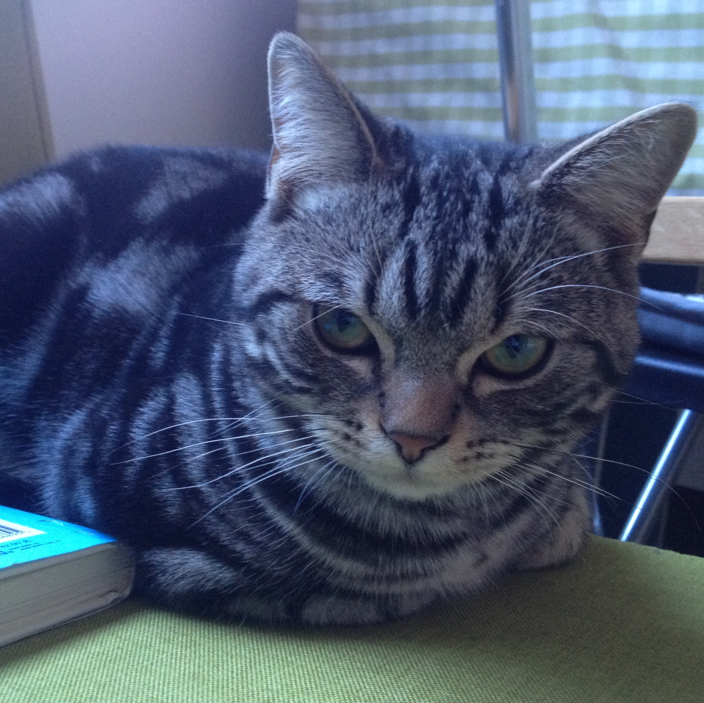

2015.12.31-365
==============
2016年1月1号上午，开始总结2015年，昨天晚上已经总结了过去一年看过的电影、读过的书、听过的音乐。总结完之后发现真的很累很累，将之前标记的内容有重新翻了一下，然后回忆当初的感受。有一些印象深刻的东西，但是大部分还是被遗忘掉了，忘记了当时的感受是什么，这其实也是这一年最大的一个感触——太匆匆。太着急去看一部电影，太着急去读一本书，太着急去听一张专辑，太着急去认识一个人。做了那么多的事情却很少去总结和感受，一直在往前走，却不知道要走去哪里。所以新的一年的期许就是放慢脚步，有计划、有节奏、有目的、有感受的去做一些事情。根据2015年的计划，现在总结一下这过去的一年：

1. 照片。年初的计划是Instagram上的照片达到3500张，现在看已经达到了3552张。有一些是过去拍的照片，还有不少猫咪的照片。现在的拍照依然没有什么目的性，也看了几本有关摄影的书籍。现在依然把拍照当作记录生活的一种方式，不过自己很少使用自己拍摄的照片，例如在一篇文章中插入自己的照片，或者说在一些设计中去使用这些照片。总之，照片背后的故事性太少了。新的一年应该尝试着有目的有感受的去拍一些照片，然后就是应该多传播。
2. 阅读。这一年总体来看读了不少书，也买了不少书。计划是达到700本，现在看已经标记有724本了，这其中还有两类书集中读了不少，一类是关于设计，一类是关于建筑。但是许多书自己读的太匆忙，并未完全掌握书中的知识，还有就是自己太少做笔记了，总体来说会觉得收获不大。还有就是可能为了充数，自己读了许多价值不是很高的书，浪费了时间却没有收获。新的一年应该在选书上慎之又慎，读之前可以先了解一下整本书的评价和背景，然后就是多多去做笔记，阅读的时候应该有所感受。最后就是应该养成好的阅读习惯，每天给出时间去做专门的阅读。
3. 写作。去年刚开始的时候，自己做了一个2015-Daily-Recording的项目，当时计划是每天写一篇东西，坚持一年。这个项目坚持下来了，但是自己真正写的东西很少，更多的变成了转载项目。即使如此还是有所收获的，自己明白了问题出在什么地方，新的一年项目该如何去做。其次关于写作的项目就是自己在11月的时候开通了微信公众号，以后也可以作为一个写作平台。不过自己还是可以将douban作为写作的基础平台，因为每天打开豆瓣的频次还是挺高的。
4. 电影。过去一年里依然看了不少电影，而且远超了计划，现在标记的数目已经达到了1793部。总结电影时，自己也提到了虽然看了这么多部电影，但是自己更多的是在一心多用的去看一部电影，而没有放下手中的工作好好去欣赏。同时，自己过去的一年真的看了不少烂片，然后在电影院也看了不少电影，然后也写了一些影评。新的一年应该是为了看电影而看电影，而且看之前应该问自己这是否值得去看？
5. 音乐。豆瓣上标记听过的专辑数量已达645张。同电影一样，自己其实也很少好好的去欣赏一张专辑。新的一年也希望能买好的设备来听音乐，多了解音乐背后的美好，然后可以将这些音乐应用到自己的生活中来。
6. 学习。不可否这一年依然有在学习。不过现在很少能真正完成公开课的内容，这也说明自己没有系统的掌握一门课程，新的一年应该更加专注起来，将精力放在真正想学的内容上。关于英语，10月份的时候自己报了托福，计划是今年1月份考试，但是显然还没有准备好，已经准备往后推了，但是不管怎样，自己开始做这件事情了。关于日语，有尝试着开始日语学习，但是没有好的规划，也没有坚持下来。下半年有段时间集中看了不少有关设计和建筑方面的书籍，也有计划做深入的学习，但是缺少好的计划，依然收获寥寥。这一年快结束的时候又开始研究起机器人来，这是结合着机械设计、编程、图形学、硬件的一个项目，自己兴趣很大，新的一年可以专注于这个项目。
7. 工作。上半年工作很忙，下半年工作没那么忙了。参与了一些项目和课题，但是依然觉得自己的进步不快，还是有许多内容没有触及到，但是这些内容多数是在项目实践中才能掌握的，而无法做那么多项目，这一点很令人头疼。不得不说有时候工作上的状态会影响到自己。但是这一年考取了两个证书，一个是职称英语，一个是职称计算机。无法从实际项目中获得太多知识，自己应该考虑如何从理论中来获得，并应用到实际中。
8. 活动。过去一年参加了不少的活动，看了一些展览，例如lens的、sofarbeijing等，但是自己都没有好好总结过，有些是分享到了朋友圈，这样还有些印象，有些就完全忘记了。事实上自己可以将每一次的活动都整理成一篇文章，一方面有了写作的素材，另一方面也可以使用到自己拍摄的照片，这样的收获才更大，年终的时候还可以评一个十佳活动。最后值得一提是自己在年末参加sofarbeijing的活动时，自己还是作为志愿者参加的，这算是自己的一次尝试，感觉很成功，新的一年应该多尝试一些这样的活动。
9. 运动。过去的一年，自己真的没怎么运动，体格依然很瘦，新的一年，这一点自己应该重点要关注。秋末的时候，自己买了一辆自行车，还没怎么骑，天气就变冷了。夏天的时候想要去学游泳。
10. 驾照。坚持了三个月，自己拿到了驾照，这算是过去一年一项比较大的收获，但是学车的过程是痛苦和漫长的。
11. 翻译。和别人一起翻译一本书，坚持了一个月每周末花一天时间和某人一起翻译，这段时间无疑是愉快而美好的。同时自己也尝试着翻译了一本小书《How to Make Sense of Any Mess》，但是有些仓促，虽然翻完了，但是没有整理的很好。然后其他还有一些想要翻译的东西，在计划中了。不得不说翻译还是件耗费大块时间和精力的事情，但也是容易坚持下来和有成就感的事情。
12. 2015-Daily-Recording的项目。自己在写作中也提了，自己计划每天写一篇文章的，虽然最终大部分并非原创的，但是自己做到了每天一篇。而现在写的这篇就是2015年的第365篇，新的一年会有2016-Daily-Recording，原创的内容会增多，重要的是自己应该为这个项目做好计划，留出时间。
13. 积极心理学。十月十一月的时候，自己开始看哈佛大学的幸福课，就这样连续看，虽然并非专心致志，甚至都没有按照顺序，24节课还是看完了。收获很多，情绪变得更稳定了，对一些事情也没那么困扰了。想想自己困扰的问题，其他人也困扰过，这样就没觉得那么无助了。自己还曾想过专门做个网站来传播积极心理学，终究是没有做起来，可以作为新年计划。
14. 关系。这一年真的是认识了不少人，有些人没联系了，有些人还在联系，有些人将会联系。这一年大学宿舍的一个室友结婚了，同宿舍的六个人又见了一次面。这一年有人结婚，有人去世，这一年回家3次，合计才半个月的时间。这一年因为出差和一些城市也建立了关系。不仅同人、城市建立关系，在这一年最后一个月和一只猫咪也建立了关系，它的名字叫Brian。有时在想，不管最后的结果如何，这样一段关系总是令人感激和怀念的。

最后，新的一年希望自己try more，do more，think more，feel more，无所畏惧，做真正能触动内心的事情。

2015.12.31